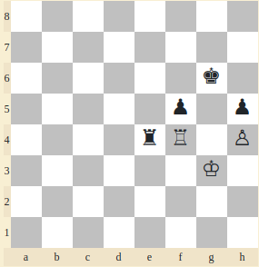

# Cyprus Cyber Security Challenge 2021 CTF
## Crypto - Forced Draw Writeup


### Description:
I kept telling him it’s a forced draw but he didn’t believe me. We played it out a for a while until he finally realized and agreed on a draw. What a
noob! 
I was so tilted towards the end I forgot to write down the last 7 moves... 
The officials couldn’t help me much. They just gave me some hashes and their hashing algorithm. 
Can you help me figure out what the last 7 moves were? 
Flag Format: Concatenate moves 49, 50, 51, 52, 53, 54 and 55 with _ (without the move number) and wrap in CCSC{}. 

Example: 

20. c5+ Kh8 
21. Qc4 Bg5 
22. Qxd4 Qxd4
23. Bxd4 Nxd3
24. Bxe3 Rae8
25. Bf2 Bxf4
26. Bxc6 Bh3+
27. Bg2 Bxg3

CCSC{c5+_Kh8_Qc4_Bg5_Qxd4_Qxd4_Bxd4_Nxd3_Bxe3_Rae8_Bf2_Bxf4_Bxc6_Bh3+_Bg2_Bxg3}

### ```Hash.py```
```python
t = [[[14586168612424419542, [...REDACTED...], 16748868775416160675]]]

m = {k: v for v, k in enumerate('PNBRQKpnbrqk')}


def hash(b):
    h = 0
    for i in range(8):
        for j in range(8):
            if b[i][j] in m:
                p = m[b[i][j]]
                h ^= t[i][j][p]
    return f'%016x' % h
```

We can see the ```hash(b)``` function has a parameter ```b``` which seems like it is the entire 8x8 chess board. It iterates over all squares and ```xors``` the specific value from the table ```t``` according to the position of each chess piece inside the dictionary ```m```. So in essence each hash describes the state of the board at any given moment. More [here](https://iq.opengenus.org/zobrist-hashing-game-theory/)

Board shape:
```python
[
    ['r', 'n', 'b', 'q', 'k', 'b', 'n', 'r'],
    ['p', 'p', 'p', 'p', 'p', 'p', 'p', 'p'],
    ['-', '-', '-', '-', '-', '-', '-', '-'],
    ['-', '-', '-', '-', '-', '-', '-', '-'],
    ['-', '-', '-', '-', '-', '-', '-', '-'],
    ['-', '-', '-', '-', '-', '-', '-', '-'],
    ['P', 'P', 'P', 'P', 'P', 'P', 'P', 'P'],
    ['R', 'N', 'B', 'Q', 'K', 'B', 'N', 'R']
]

```

### Chain of thought
We are given the first 48 out of 55 moves of the game and 16 hashes. As mentioned above each hash represents the state of the board, **so the difference of two consecutive hashes is the moved piece**. We can find the difference (the moved piece), by xoring 2 concecutive hashes with eachother.

In Example: 
```
x = A xor B xor C
y = A xor B xor D

diff = x xor y = C xor D
```

If we xor two hashes the result is two values from the table ```t```, the start position and the final position of the corresponding piece. After finding the difference we can reverse look up the indexes of ```t``` and find out which piece was moved and where. 

The only issue would be if we couldn't find two values that make up the difference. What that means is that a piece must have been taken because it is absent from the board, remember that each value from ```t``` corresponds to a specific piece on a specific square.

### Playing the Game

I'm Using [this](https://www.dcode.fr/chess-notation) tool to play out the moves. Pasting the 48 moves we see this:



Hmm... The challenge title and description imply that the match ended in a draw. In order for that to happen it means that both Rooks in the board must the taken by their opponent. We can manualy play that part out. 

Also the first two hashes match to the last move and we can use that to check the collumns and rows of our script. Note that the hashing function differentiates the pieces using upper for white and lower for black pieces where as the SEN [codes](./game.txt) use upper accross the board.

### Solving
Running the first iteration yields two possible moves:

```bash
-------Turn 0-------
Possible Move a: re5
Possible Move b: re4
```
This means that the **Black** Rook has moved to either from E4 to E5 or vice verse and it is confirmed, by looking at the last turn on Move 48: **Re48** which indeed describes a Rook on E4 (that means the rook was on E5 first). With our column, row and piece arrangement set up, we can test the hashes.

Running the next iteration yields no Moves. A piece must have been taken then. Looking at the board arrangement and the fact that this is a Draw, the logical thing for the white player is to take the Black Rook at E4 and subsequently, then the black pawn takes the white Rook. This is also confirmed by running the 3rd iteration yielding no moves.

```solve.py```

```python
m_inv = {v: k for v, k in enumerate('PNBRQKpnbrqk')}
alpa = 'abcdefgh'

new_t = []
for i in range(len(t)):
    for j in range(len(t[i])):
        for k in range(len(t[i][j])):
            new_t.append(t[i][j][k])
```

Create a new inverted dictionary to reverse-lookup the pieces, also create a new 1D array to make it easier to find the values later.


```python
if __name__ == "__main__":
    hashes = [int(x,16) for x in open("hashes.txt", 'r').read().split("\n")]
    for i, (h1, h2) in enumerate(zip(hashes, hashes[1::])):
        print(f"-------Turn {i}-------")
        get_move(h1 ^ h2)
```
Read the hashes and calculate the difference of each pair of consecutive hashes, pass the result into the ```get_move()``` function to try and calculate the move.

```python
def get_move(res):
    for i in range(len(new_t)):
        for j in range(len(new_t)-1):
            if new_t[i] ^ new_t[j] == res:
                # print(f'{i} - {j}')
                c1, r1, p1 = find(new_t[i])
                c2, r2, _ = find(new_t[j])
                # print(f"Start Pos: {r1} {c1}")
                # print(f"End Pos: {r2} {c2}")
                # print(f"Piece Moved: {m_inv[p1]}")
                print(f"Possible Move a: {m_inv[p1]}{alpa[r1]}{8-c1}")
                print(f"Possible Move b: {m_inv[p1]}{alpa[r2]}{8-c2}")
                return
    print(f"A piece must have been taken!")
```
Loop through each element of the flatten table and check whether there are two values that create the difference of the two hashes. If a value is present then look up the indicies of each in the original ```t``` array. That will give us two pairs of the set (column, row) and one piece name. We look up the columns and rows and display the two possible moves. Since we are in-line with the current game, one of them will be the current board position and the other one will be the resulting square.

The only thing now is to run the script, get the possible moves and try and play out the game.


<details>
      <summary>Flag: </summary>
        CCSC{Rxe4_fxe4_Kf4_e3_Kxe3_Kf6_Kf4_Kg6_Kg3_Kf5_Kh3_Kg6_Kg3_Kh6}
</details>


