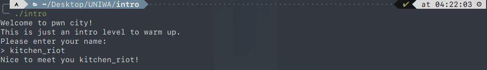
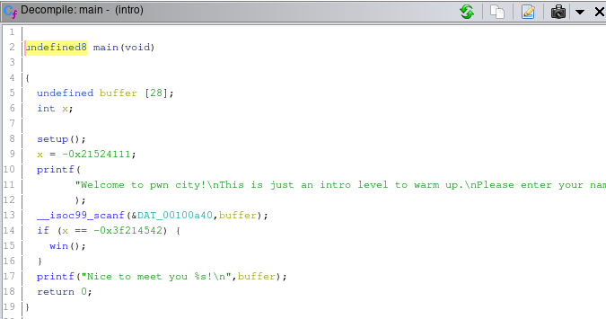
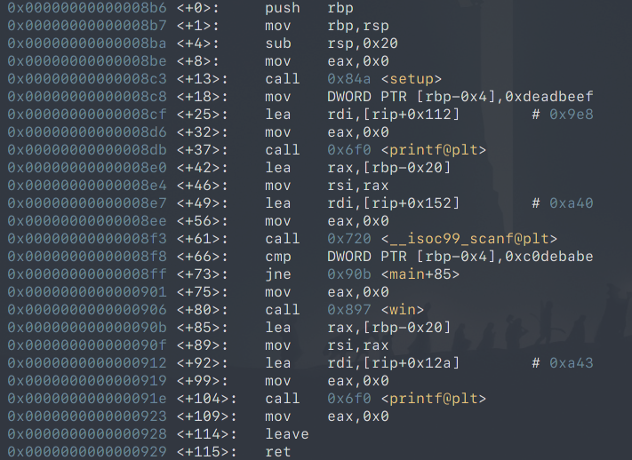

# Intro - UNIWA 2020 CTF

This is an introductory pwning challenge. On running a simple prompt asks for a string input and greets you based on your input:



Lets open it up with Ghidra and analyze it:



We see 2 local variables, a string with 28 characters (```buffer```) and an int (```x```) variable initialized with ```0xdeadbeef @ main+18``` .

A ```scanf``` is performed and the output is placed into ```buffer```.

Then oddly enough if the value of ```x``` has changed and is compared to ```0xc0debabe @ main+66``` (2) and if equal the ```win``` function is called, which provides with with the flag.

Let's debug with GDB:



The stack frame it's exactly 32 byes long, just enough to accomodate the 28 byte buffer and the 4 byte integer. Further more we can construct the stack layout. We know that the variable x resides in the address of
```rbp-0x4``` and the buffer address resides in ```rbp-0x20 or rsp```.

Since the x variable is on a lower address than the buffer we can overwrite it with our own data by overflowing the buffer: 

So we can send (as bytes) any 28 bytes we want + the 4 needed bytes to make the compare true, also pack a newline character to trigger ```scanf```.

```
payload = b""
payload += b"A" * 28
payload += b"\xbe\xba\xde\xc0" #little-endian 0xc0debabe
payload += b"\n"
```

If all goes well the server should reply with the correct flag.
